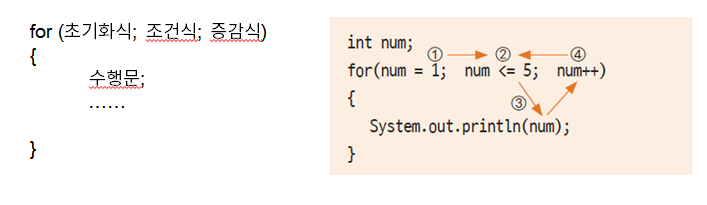

바이트디그리 듣다가 헷갈리거나 기억 안 나는 부분들 메모

##### 1주차

###### utf

  UTF-8: 1바이트에서 4바이트까지 다양하게 문자를 표현할 수 있음

  UTF-16: 2바이트로 문자를 표현


###### type inference

  java 10 부터 지원하는 기능

  local variable에 대해 자료형 선언 없이 사용할 수 있음

  단 추론 된 변수는 다른 타입 대입 불가

```java
public class LocalVariableType {
	public static void main(String[] args) {
		var i = 10;
		var s = "ten";
		
		// this occurs error
		s = 10;
	}
}
```


###### Literal

  상수, boolean 값 등을 말함

  메모리에 로드 될 때 미리 할당되고 프로그램 exit시에 반환

  미리 할당 되는 부분을 data area / constant pool 등으로 부름

cf) static 변수도 미리 할당됨


---

###### short circuit evaluation

  논리 연산 할 때 모든 항이 실행되지 않는 경우

  && - 앞 항이 false면 뒤 항 실행하지 않음

  || - 앞 항 true면 뒤 항 실행하지 않음

```java
public class ShortCircuitEvaluation {
  public static void main(String args[]) {
    var a = 10;
    var b = 20;
    
    // 11, 20
    System.out.println((++a == 10) && (++b != 20));
    // 12, 20
    Systtem.out.println(++a == 12) || (++b == 20));
  }
}
```


###### Switch Expression

  Java 14부터 지원

  쉼표로 조건 구문, `break` 사용 x

  `yield` keyword 사용해서 return 받을 수 있음. 단 return 값 없을 경우 error

```java
public class SwitchExpression{
  public static void main(String args[]) {
    Scanner scanner = new Scanner(System.in);
    var month = scanner.next();
    
    var day = switch (month) {
      case "Jan", "Mar", "May", "Jul", "Aug", "Oct", "Dec" -> {
          yield 31;
        }
        case "Apr", "Jun", "Seb", "Nov" -> {
          yield 30;
        }
        case "Feb" -> {
          yield 28;
        }
        default -> {
          yield "no";
        }
    }
    System.out.println(month + " has " + day + "days.");
  }
}
```


###### for 정리

  수행 순서




###### for each

  iterator 반복문

  순차적 반복만 가능함

```java
String[] colors = {"red", "blue", "green", "yellow"};
for (String color: colors) {
  System.out.println(color);
}
```


---


